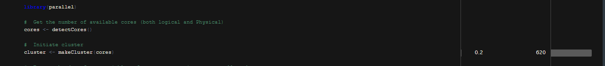
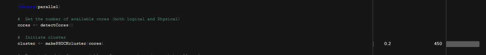
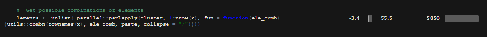
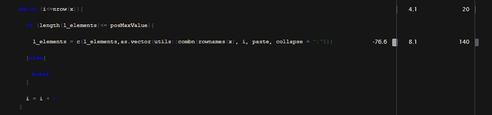

```{r, include = FALSE}
knitr::opts_chunk$set(
  collapse = TRUE,
  comment = "#>"
)
```

## What is Knapsack Problem?

The knapsack problem is a optimization , maximization problem where  a given set of items, each with a weight and a value, determine the number of each item to include in a collection so that total weight is less than or equal to a given limit and the total value is as large as possible. For instance take vegetables. Then V stands for value of the vegetables with its weight (w) in (kg) and W is the total capacity of the bag. The goal is to fill the bag with the most valuable items within the capacity of the bag.

By implementing the algorithm using different methods we try to understand how time and space complexity plays a crucial role in writing Fast R codes. We also try to optimize our brute force algorithm using parallelism.

The following data is used as sample
```{r setup}
library("optimizationAlgorithms")

set.seed(42)
n <- 2000
knapsack_objects <-
data.frame(
w=sample(1:4000, size = n, replace = TRUE),
v=runif(n = n, 0, 10000)
)
```


In this package we demonstrate the solution for knapsack problem using three different methods namely:

## 1.Brute Force Method

### i. Normal Approach
The brute force method is the slowest method since This algorithm enumerates all n-combinations of n objects to find the max value and all the elements that can be fitted into the knapsack.

This method runs at $O(2^n)$ evaluating the $2^n$ possible combinations.

example:

```{r}
brute_force_knapsack(x = knapsack_objects[1:8,], W = 3500)
```
Now lets Check the time taken to run the function

```{r}
system.time(brute_force_knapsack(x = knapsack_objects[1:8,], W = 3500, parallel = FALSE))
```

The time taken to run n=16 samples is :
```{r}
system.time(brute_force_knapsack(x = knapsack_objects[1:16,], W = 3500, parallel = FALSE))
```

The time taken to run n=20 samples is :
```{r}
# system.time(brute_force_knapsack(x = knapsack_objects[1:20,], W = 3500, parallel = FALSE))
#>    user  system elapsed 
#>   48.14    0.00   48.50
```
As you can see there is a significant increase in execution time as n increase

### ii. Process with parallelism enabled
In this approach, we utilize multiple cores (processors) to run  tasks. i.e usually any given task will run sequentially, but R gives flexibility to utilize the full potential of all the cores by distributing the tasks parallelly.

Refer the following CPU utilization image, there are 3 Rscript.exe process which are spun from the single script. This is because in the script there are 3 tasks that will run parallel independent of each other.


 
In brute force method we are distributing the $2^n$ combinations to happen in multiple cores. This approach yields good results as the n value increases. But beyond n = 25, the program lags as the number of combinations formed will also effect the memory limit of an array.

The time taken to run n=16 samples when Parallelism is enabled :
```{r}
system.time(brute_force_knapsack(x = knapsack_objects[1:16,], W = 3500, parallel = TRUE))
```

The time taken to run n=20 samples when Parallelism is enabled :
```{r}
# system.time(brute_force_knapsack(x = knapsack_objects[1:20,], W = 3500, parallel = TRUE))
#>    user  system elapsed 
#>    0.33    0.20   3.11
```

## 2.Dynamic Programming

This approach runs at $O(Wn)$ time complexity. This yields the exact output and discrete values as input. This method works faster than the brute force approach.

```{r}
system.time(knapsack_dynamic(x = knapsack_objects[1:8,], W = 3500))
```
The time taken to yield result for n=500 samples is :

```{r}
system.time(knapsack_dynamic(x = knapsack_objects[1:500,], W = 3500))
```

It clearly shows how fast this approach is compared to Brute force. Note that we calculated the result for 500 observations compared to only 16 in the brute force approach.

## 3.Greedy Heuristic Method

This approach gives a 50% accurate maximum values while considerably minimizing the time complexity to $O(nlog(n))$ .
 

```{r}
system.time(greedy_knapsack(x = knapsack_objects[1:800,], W = 3500))
``` 
```{r}
system.time(greedy_knapsack(x = knapsack_objects[1:1000000,], W = 3500))
``` 

This method  proves to be the fastest among others while giving only 50% accurate maximum values.This method is versatile in calculating approximate values for large samples of data.

# Profiling
## Brute Forece Method:
Using profvis profiler, it was identified that by default the *parallel::makeCluster(core)* takes more time (620 ms) to spin the workers when compared to *parallel::makePSOCKCluster(core)* (450 ms). Refer below images

 

 
 
 In addition, we also observed that, in brute force method, since we are selecting the best value out of all possible combinations, the program was taking more time in parLapply method since program had to form all possible combination and combine the combination in string format for further processing. As n value increases this task becomes bottleneck. Refer below image to visualize the time take by the task for n = 20 
 


As a remedy we tried to introduce while loop instead of parLapply and limit the combination of elements such that we allow the algorithm to form combination only till maximum weight that can be filled. In that way we save time that the algorithm would spend on forming un-necessary string combinations. 



By this we could achieve a gain of approximately 20 sec for n = 20, and the original program was not rendering any output for beyond n = 20, but after treating the bottleneck we could visualize the output till n = 25 (~108 sec)

Finally as n values still increases beyond n = 25, the number of combination formed will exceed the memory that an array can hold (4GB).

## Dynamic Method:
 The program written is taking $O(Wn)$ duration and there is no major bottleneck observed.
 
## Greedy Method:
  The program written is taking  $O(nlog(n))$ duration and there is no major bottleneck observed.
